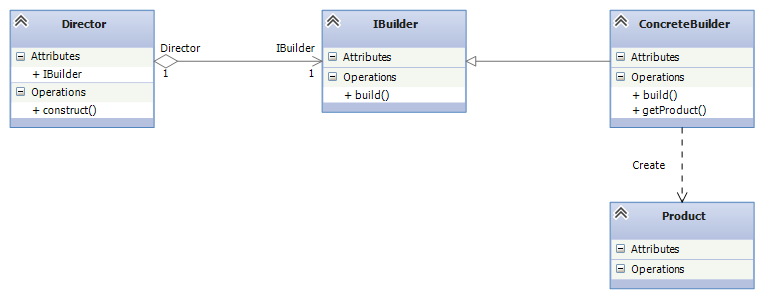
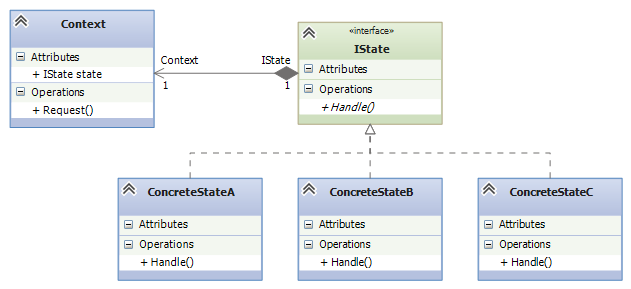

# Patrones de Diseño en .NET

## Índice

1. [Singleton](#singleton)
2. [Factory Method](#factory-method)
3. [Dependency Injection](#dependency-injection)
4. [Repository Pattern](#repository-pattern)
5. [Unit of Work Pattern](#unit-of-work-pattern)
6. [Strategy Pattern](#strategy-pattern)
7. [Builder Pattern](#builder-pattern)
8. [State Pattern](#state-pattern)
9. [Cuándo usar cada patrón](#cuándo-usar-cada-patrón)

---

## Introducción

Los patrones de diseño son soluciones generales y reutilizables a problemas comunes que surgen durante el desarrollo de software. En este repositorio encontrarás los patrones más utilizados en aplicaciones .NET, con ejemplos claros que van desde la definición de interfaces hasta su implementación concreta, junto con cuándo y por qué usar cada uno.

---

## Singleton

### Tipo
Patrón creacional.

### Problema que resuelve
Garantiza que una clase tenga una única instancia y proporciona un punto global de acceso a ella. Útil cuando se necesita coordinar acciones en todo el sistema, como configuraciones globales o logger.

### Cuándo usarlo
- Cuando exactamente una instancia de una clase es necesaria para coordinar acciones del sistema.
- Cuando se necesita un acceso global a algún recurso (ej. configuración, conexiones, logs).
- Cuidado: puede dificultar las pruebas unitarias acoplar código directamente a la clase Singleton.

### Ejemplo: Interfaz e implementación

```csharp
// Interfaz que define el contrato
namespace DesignPatterns.Singleton
{
    public interface ISingleton
    {
        string GetValue();
        void SetValue(string value);
    }
}

// Implementación con instancia única
namespace DesignPatterns.Singleton
{
    public class Singleton : ISingleton
    {
        private static readonly Singleton _instance = new Singleton();
        private string _value;

        private Singleton() { }

        public static Singleton Instance => _instance;

        public string GetValue() => _value;
        public void SetValue(string value) => _value = value;
    }
}
```

### Uso

```csharp
var singleton = Singleton.Instance;
singleton.SetValue("Hola Mundo");
Console.WriteLine(singleton.GetValue()); // Output: Hola Mundo
```

---

## Factory Method


### Tipo
Patrón creacional.

### Problema que resuelve
Proporciona una interfaz para crear objetos en una superclase, pero permite a las subclases decidir qué instancia crear. Elimina la necesidad de instanciar clases directamente con `new`.

### Cuándo usarlo
- Cuando una clase no sabe qué clase de objeto necesita crear.
- Cuando las clases quieren que sus subclases especifiquen los objetos que se crearán.
- Cuando se quiere delegar la responsabilidad de la creación de objetos.

### Ejemplo: Interfaz e implementación

```csharp
// Interfaz producto
namespace DesignPatterns.FactoryPattern
{
    public interface ISale
    {
        void Sell(decimal total);
    }
}

// Productos concretos
namespace DesignPatterns.FactoryPattern
{
    public class StoreSale : ISale
    {
        private readonly decimal _extra;
        public StoreSale(decimal extra) => _extra = extra;
        public void Sell(decimal total) => Console.WriteLine($"Venta en tienda: {total + _extra}");
    }

    public class InternetSale : ISale
    {
        private readonly decimal _discount;
        public InternetSale(decimal discount) => _discount = discount;
        public void Sell(decimal total) => Console.WriteLine($"Venta en internet: {total - _discount}");
    }
}

// Creador abstracto
namespace DesignPatterns.FactoryPattern
{
    public abstract class SaleFactory
    {
        public abstract ISale GetSale();
    }

    // Factories concretas
    public class StoreSaleFactory : SaleFactory
    {
        private readonly decimal _extra;
        public StoreSaleFactory(decimal extra) => _extra = extra;
        public override ISale GetSale() => new StoreSale(_extra);
    }

    public class InternetSaleFactory : SaleFactory
    {
        private readonly decimal _discount;
        public InternetSaleFactory(decimal discount) => _discount = discount;
        public override ISale GetSale() => new InternetSale(_discount);
    }
}
```

### Uso

```csharp
var factory = new StoreSaleFactory(5m);
var sale = factory.GetSale();
sale.Sell(100m); // Output: Venta en tienda: 105
```

---

## Dependency Injection

### Tipo
Patrón estructural (infraestructura .NET).

### Problema que resuelve
Desacopla la creación de dependencias de su consumo. En lugar de que una clase cree sus propias dependencias (acoplamiento fuerte), se las proporciona desde fuera. Facilita el testing, mantenimiento y escalabilidad.

### Cuándo usarlo
- Cuando quieres desacoplar módulos y facilitar el reemplazo de implementaciones.
- Cuando escribes código testable con mocks/stubs (inyectar mocks en lugar de dependencias reales).
- En aplicaciones .NET Core/5+ donde el contenedor de servicios está integrado en `Program.cs`.

### Ejemplo: Inyección en .NET Core

```csharp
// En Program.cs o Startup.cs
builder.Services.AddSingleton<IConfiguration>(config);
builder.Services.AddScoped<IUserService, UserService>();
builder.Services.AddTransient<ICalculationService, CalculationService>();

// En una clase consumidora
public class OrderController
{
    private readonly IUserService _userService;
    private readonly ICalculationService _calculationService;

    public OrderController(IUserService userService, ICalculationService calculationService)
    {
        _userService = userService;
        _calculationService = calculationService;
    }

    public IActionResult CreateOrder() 
    {
        // Las dependencias son proporcionadas automáticamente
        var user = _userService.GetCurrentUser();
        // ...
    }
}
```

---

## Repository Pattern


### Tipo
Patrón estructural.

### Problema que resuelve
Abrevia la separación entre la capa de dominio y el capa de datos, encapsulando la lógica de consulta y persistencia. Actúa como una interfaz entre la aplicación y el ORM (como Entity Framework) o base de datos.

### Cuándo usarlo
- Cuando quieres abstraer el acceso a datos y poder cambiar de ORM o base de datos sin afectar el código de negocio.
- Cuando quieres escribir pruebas unitarias sin necesidad de una base de datos real (usando repositorios mock).
- En aplicaciones con separación clara entre dominio e infraestructura.

### Ejemplo: Interfaz e implementación

```csharp
// Interfaz de repositorio
namespace DesignPatterns.RepositoryPattern
{
    public interface IBeerRepository
    {
        IEnumerable<Beer> GetAll();
        Beer Get(int id);
        void Add(Beer data);
        void Update(Beer data);
        void Delete(int id);
        void Save();
    }
}

// Implementación concreta
namespace DesignPatterns.RepositoryPattern
{
    public class BeerRepository : IBeerRepository
    {
        private readonly DesignPatternsContext _context;

        public BeerRepository(DesignPatternsContext context) => _context = context;

        public IEnumerable<Beer> GetAll() => _context.Beers.ToList();
        public Beer Get(int id) => _context.Beers.Find(id);
        public void Add(Beer data) => _context.Beers.Add(data);
        public void Update(Beer data) 
        { 
            _context.Entry(data).State = Microsoft.EntityFrameworkCore.EntityState.Modified; 
        }
        public void Delete(int id) 
        { 
            var beer = _context.Beers.Find(id); 
            if (beer != null) _context.Beers.Remove(beer); 
        }
        public void Save() => _context.SaveChanges();
    }
}
```

### Uso

```csharp
using (var context = new DesignPatternsContext())
{
    var repo = new BeerRepository(context);
    var beer = new Beer { Name = "Corona", Style = "Blonde" };
    repo.Add(beer);
    repo.Save(); // Confirma los cambios en la BD
}
```

---

## Unit of Work Pattern


### Tipo
Patrón estructural.

### Problema que resuelve
Agrupa múltiples operaciones de repositorio en una sola transacción. En lugar de llamar a `Save()` en cada repositorio individualmente, el patrón Unit of Work acumula todos los cambios y los confirma de una sola vez, manteniendo la integridad de los datos.

### Cuándo usarlo
- Cuando tienes que realizar múltiples cambios en diferentes tablas/entidades que deben aplicarse como una sola operación atómica.
- Cuando quieres reducir el número de llamadas a `SaveChanges()` en Entity Framework.
- En escenarios de "transacción completa" donde si falla una operación, todas se revierten.

### Ejemplo: Interfaz e implementación

```csharp
// Interfaz Unit of Work
namespace DesignPatterns.UnitOfWorkPattern
{
    public interface IUnitOfWork
    {
        IRepository<Beer> Beers { get; }
        IRepository<Brand> Brands { get; }
        void Save();
    }
}

// Implementación
namespace DesignPatterns.UnitOfWorkPattern
{
    public class UnitOfWork : IUnitOfWork
    {
        private readonly DesignPatternsContext _context;
        private IRepository<Beer> _beers;
        private IRepository<Brand> _brands;

        public UnitOfWork(DesignPatternsContext context) => _context = context;

        public IRepository<Beer> Beers
        {
            get => _beers ??= new Repository<Beer>(_context);
        }

        public IRepository<Brand> Brands
        {
            get => _brands ??= new Repository<Brand>(_context);
        }

        public void Save() => _context.SaveChanges();
    }
}
```

### Uso

```csharp
using (var context = new DesignPatternsContext())
{
    var uow = new UnitOfWork(context);
    
    // Agregar múltiples entidades
    uow.Beers.Add(new Beer { Name = "Corona" });
    uow.Brands.Add(new Brand { Name = "Modelo" });
    
    // Confirmar todos los cambios en una sola transacción
    uow.Save(); 
}
```

---

## Strategy Pattern


### Tipo
Patrón de comportamiento.

### Problema que resuelve
Define una familia de algoritmos, encapsula cada uno y los hace intercambiables. Permite que el algoritmo varíe independientemente de los clientes que lo usan. Ideal cuando tienes múltiples variantes de comportamiento que pueden cambiar en tiempo de ejecución.

### Cuándo usarlo
- Cuando tienes muchas variantes de un comportamiento y quieres evitif / switch statements.
- Cuando el comportamiento debe poder cambiar en tiempo de ejecución.
- Cuando quieres aislar cada variante de lógica en su propia clase para mejor mantenimiento.

### Ejemplo: Interfaz e implementación

```csharp
// Interfaz estrategia
namespace DesignPatterns.StrategyPattern
{
    public interface IStrategy
    {
        void Run();
    }
}

// Implementaciones concretas
namespace DesignPatterns.StrategyPattern
{
    public class CarStrategy : IStrategy
    {
        public void Run() => Console.WriteLine("Soy un carro y me muevo con 4 llantas");
    }

    public class MotoStrategy : IStrategy
    {
        public void Run() => Console.WriteLine("Soy una motocicleta y me muevo con 2 llantas");
    }
}

// Contexto que usa la estrategia
namespace DesignPatterns.StrategyPattern
{
    public class Context
    {
        private IStrategy _strategy;

        public Context(IStrategy strategy) => _strategy = strategy;

        public IStrategy Strategy
        {
            set => _strategy = value;
        }

        public void Run() => _strategy.Run();
    }
}
```

### Uso

```csharp
// Cambiar comportamiento en runtime
var context = new Context(new CarStrategy());
context.Run(); // Output: Soy un carro y me muevo con 4 llantas

context.Strategy = new MotoStrategy();
context.Run(); // Output: Soy una motocicleta y me muevo con 2 llantas
```

---

## Builder Pattern



### Tipo
Patrón creacional.

### Problema que resuelve
Separar la construcción de un objeto complejo de su representación, de modo que el mismo proceso de construcción pueda crear diferentes representaciones. Evita constructores con muchos parámetros y permite crear objetos paso a paso.

### Cuándo usarlo
- Cuando la creación de un objeto requiere muchos pasos o parámetros opcionales.
- Cuando quieres crear representaciones diferentes (tipos) de un objeto usando el mismo código de construcción.
- Cuando el objeto tiene muchos campos y no quieres un constructor con 10+ parámetros.

### Ejemplo: Interfaz e implementación

```csharp
// Interfaz builder
namespace DesignPatterns.BuilderPattern
{
    public interface IBuilder
    {
        void Reset();
        void SetAlcohol(decimal alcohol);
        void SetMilk(int milk);
        void SetWater(int water);
        void AddIngredient(string ingredient);
        void Mix();
        void Rest(int time);
    }
}

// Producto resultado
namespace DesignPatterns.BuilderPattern
{
    public class PreparedDrink
    {
        public List<string> Ingredients = new();
        public int Milk;
        public int Water;
        public decimal Alcohol;
        public string Result;
    }
}

// Builder concreto
namespace DesignPatterns.BuilderPattern
{
    public class AlcoholicDrinkBuilder : IBuilder
    {
        private readonly PreparedDrink _drink = new();

        public void Reset() => _drink = new PreparedDrink();
        public void SetAlcohol(decimal alcohol) => _drink.Alcohol = alcohol;
        public void SetMilk(int milk) => _drink.Milk = milk;
        public void SetWater(int water) => _drink.Water = water;
        public void AddIngredient(string ingredient) => _drink.Ingredients.Add(ingredient);
        public void Mix() => _drink.Result = $"Mezclando: {string.Join(", ", _drink.Ingredients)}";
        public void Rest(int time) => Thread.Sleep(time); // Simulación

        public PreparedDrink GetDrink() => _drink;
    }
}
```

### Uso

```csharp
var builder = new AlcoholicDrinkBuilder();

// Construir una margarita
builder.AddIngredient("Tequila");
builder.AddIngredient("Triple sec");
builder.AddIngredient("Lime juice");
builder.SetAlcohol(40);
builder.SetMilk(0);
builder.SetWater(0);
builder.Mix();
builder.Rest(1000);

var drink = builder.GetDrink();
Console.WriteLine(drink.Result); 
// Output: Mezclando: Tequila, Triple sec, Lime juice
```

---

## State Pattern



### Tipo
Patrón de comportamiento.

### Problema que resuelve
Permitir que un objeto cambie su comportamiento cuando su estado interno cambia. El objeto parecerá tener diferentes clases ya que su comportamiento cambia dinámicamente según el estado, sin necesidad de if/switch statements extensos.

### Cuándo usarlo
- Cuando el comportamiento de un objeto depende de su estado actual y necesita cambiar en tiempo de ejecución.
- Cuando tienes muchas condiciones if/switch basadas en el estado actual de un objeto.
- Cuando quieres aislar cada estado en su propia clase para mejor organización.

### Ejemplo: Interfaz e implementación

```csharp
// Interfaz estado
namespace DesignPatterns.StatePattern
{
    public interface IState
    {
        void Action(CustomerContext context, decimal amount);
    }
}

// Contexto que mantiene estado y delega comportamiento
namespace DesignPatterns.StatePattern
{
    public class CustomerContext
    {
        private IState _state;
        public decimal Saldo { get; set; }

        public CustomerContext()
        {
            _state = new NewState(); // Estado inicial
        }

        public void SetState(IState state) => _state = state;

        public void Request(decimal amount) => _state.Action(this, amount);
        public void Discount(decimal amount) => Saldo -= amount;
    }
}

// Estados concretos
namespace DesignPatterns.StatePattern
{
    public class NewState : IState
    {
        public void Action(CustomerContext context, decimal amount)
        {
            Console.WriteLine($"Se le pone dinero: {amount}");
            context.Saldo = amount;
            context.SetState(new NotDebtorState());
        }
    }

    public class NotDebtorState : IState
    {
        public void Action(CustomerContext context, decimal amount)
        {
            if (amount <= context.Saldo)
            {
                context.Discount(amount);
                Console.WriteLine($"Gastado: {amount}, saldo restante: {context.Saldo}");
                if (context.Saldo <= 0) context.SetState(new DebtorState());
            }
            else
            {
                Console.WriteLine("Saldo insuficiente");
            }
        }
    }

    public class DebtorState : IState
    {
        public void Action(CustomerContext context, decimal amount)
        {
            Console.WriteLine("Cliente deudor - acción denegada");
        }
    }
}
```

### Uso

```csharp
var customer = new CustomerContext();
customer.Request(100); // Agrega 100, cambia a NotDebtorState
customer.Request(50);  // Descuenta 50 (saldo 50), sigue en NotDebtorState
customer.Request(30);  // Descuenta 30 (saldo 20)
customer.Request(25);  // Intenta descontar 25, pero saldo es 20 -> "Saldo insuficiente"
// Ahora estado cambia a DebtorState por el saldo negativo anterior
```

---

## Cuándo usar cada patrón

| Patrón | Tipo | Caso de uso principal |
|--------|------|----------------------|
| **Singleton** | Creacional | Una instancia global necesaria (logs, configuraciones, conexiones). |
| **Factory Method** | Creacional | Creación de objetos cuando la subclase debe decidir la instancia. |
| **DI** | Estructural | Desacoplamiento de dependencias y testing facil. |
| **Repository** | Estructural | Abstraer acceso a datos/ORM y cambiar proveedores fácilmente. |
| **Unit of Work** | Estructural | Agrupar múltiples operaciones en una sola transacción. |
| **Strategy** | Comportamiento | Variantes de algoritmo que cambian en tiempo de ejecución. |
| **Builder** | Creacional | Objetos complejos con muchos parámetros o variaciones. |
| **State** | Comportamiento | Comportamiento que cambia según el estado interno del objeto. |

---

## Referencias

- Este repositorio forma parte del curso "Patrones de diseño en .NET"
- Para más detalles sobre cada patrón, consultar `curso.md` en el directorio raíz
- Documentación oficial Microsoft: [Design Patterns](https://docs.microsoft.com/dotnet/standard/design-patterns)